# Comicgen

<!-- var introduction -->
We love comics. We badly wanted to create comic strips. But there was one
problem. Some of us can't draw a straight line for nuts.

But why should that stop us from creating comics? So here's a gift to ourselves
and the world &mdash; a **Comic Creator**.

We are sure you'd love the company of our friends [Dee](#?name=dee),
[Dey](#?name=dey), and our other comic friends. Go on & have some fun.
<!-- end -->

<!-- var usage -->
## Usage

A simple way to use Comicgen is from [gramener.com/comicgen/](https://gramener.com/comicgen/).

- Choose your character
- Save the image
- Insert it into your favorite editor - Illustrator, PowerPoint, Photoshop, etc.

## Plugins

You can also use Comicgen using the [plugins](#plugins) below.
(We're planning [more plugins](https://github.com/gramener/comicgen/labels/integrate). Your help is welcome!)

### Power BI plugin

The [Comicgen Power BI](https://github.com/gramener/comicgen-powerbi) plugin
lets you control the characters, emotions, poses, etc from data. Happy people
can accompany good news on charts.

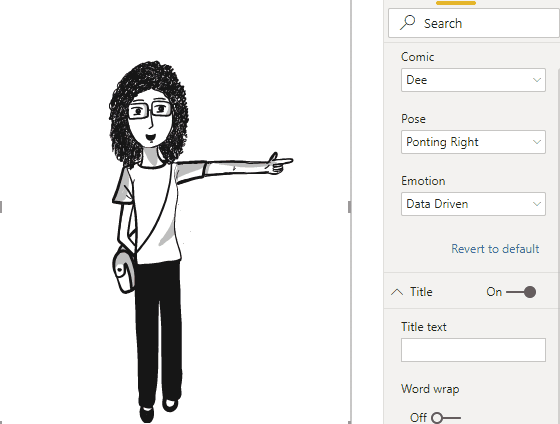

<!-- end -->

<!-- var api -->

## File API

The raw SVGs and PNGs are at
[unpkg.com/comicgen/](https://unpkg.com/comicgen/). Look under:

- [files.json](https://unpkg.com/comicgen/files.json) - list of files for each character
- [svg/](https://unpkg.com/comicgen/svg/) - SVG files for each character
- [png/](https://unpkg.com/comicgen/png/) - PNG files for each character

You can create comics by directly linking to these files.

## JavaScript API

To explicitly run comicgen on a selector, run `comicgen(selector)`. This lets
you dynamically create or change a a character.

Here's an example in jQuery showing how you can create a character dynamically:

```js
// Add the character
$('<g class="new" name="dee" angle="straight" emotion="sad" pose="yuhoo"></g>').appendTo('body')
// Call comicgen()
comicgen('.new')
```

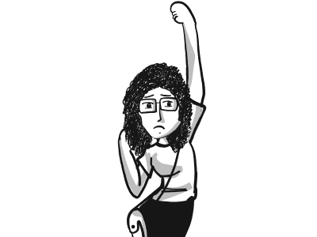

You can pass an `options` parameter to `comicgen()` to provide default values.
For example:

```js
$('<g class="new" name="dee" angle="straight"></g>').appendTo('body')
comicgen('.new', {
  name: 'dey',      // Set the default name. <g name="dee"> overrides this
  emotion: 'sad',   // Set the default emotion
  pose: 'yuhoo',    // Set the default pose, etc
  width: 400,
  height: 300
})
```


<!-- end -->

<!-- var vision -->

# Vision

We created Comicgen to help people write better stories using comic.

## Our audience are storytellers

Storytellers want to share a message and change their audience. But they worry that their content is not engaging or "catchy" enough to drive the change.

- **Comics are "catchy"**. That makes them a powerful way of engaging the audience.
- **Comics are simple**. Comics are a signal that the content is simple, interesting and often funny. Authors also make comic content simpler, interesting, and funny -- making this a virtuous cycle.
- **Comics drive emotion**. The pictures convey emotions better than just the words alone. They're funny. That helps learning, and makes the stories more memorable.

Anyone who writes an email, a presentation, or a document, is a storyteller.

Within organizations, we see this in:

- **Presenting insights**
  - **Executives' analysis**. An analyst created a poster explaining their work using comic characters. It was simple and engaging -- the entire organization understood this deep learning technique.
  - **Managers' reports**. An admin manager sent his status report as a pair of comic characters conversing. Their CEO read this report fully for the first time.
  - **Consultants' workshops**. A consultant runs a culture workshop using [comics in the presentation](https://www.businessillustrator.com/culture-change-with-comics-workshop/) because "... it's a lot less threatening than an official PowerPoint presentation."
- **Marketing stories**. This could be:
  - **Product teams launching features**. Google Chrome was launched using a [comic book](http://scottmccloud.com/googlechrome/).
  - **Marketer emails**
  - **Event manager invites**

## Comicgen makes storytelling easy

Our vision is to make storytelling with comics easy for everyone. (This includes non-designers, non-programmers, and non-storytellers.)

We do this by:

- [Adding characters](https://github.com/gramener/comicgen/labels/characters).
  Characters can be split into layers (like face & body). By combining these cleverly, we can create more characters with fewer drawings.
  If you have a character idea, please [add a comment](https://github.com/gramener/comicgen/issues/27).
- [Adding layers](https://github.com/gramener/comicgen/labels/layers). We need objects like speech bubbles, panels, headings, objects, scenery, backgrounds etc.
- [Integrate into your workflow](https://github.com/gramener/comicgen/labels/integrate). Comicgen should be easy to use in people's current workflow, with their existing tools.
    - Designers use Illustrator / Sketch
    - Developers use HTML / JS
    - Analysts use Tableau /  Power BI
    - Managers use e-mail / MS Office
    - We want to make storytelling easy for everyone
- [API for developers](https://github.com/gramener/comicgen/labels/api). Comicgen automates away the drudgery in creating comics. Developers should be able to create any comic without designing, purely using an API
- [UI for non-developers](https://github.com/gramener/comicgen/labels/builder). We want users to be able to do this without any programming. This means exposing every feature of the API should be exposed on the UI
- [Teaching](https://github.com/gramener/comicgen/labels/teach). The ultimate aim is for people to build better stories. Let's teach them

## We measure success by adoption

We succeed when more people create more and better stories with Comicgen. We measure this by

- How many people have used comicgen
- How many stories have been created using comicgen
- How many characters are present in comicgen. (Variety drives adoption)
- TODO: We need more intermediate success metrics -- things that will drive adoption

<!-- end -->

<!-- var gallery -->

# Examples

Here are some examples of Comicgen usage

- [Using Comicgen: Free comic creator](https://blog.gramener.com/using-comicgen-free-comic-creator/)
- [Why Game of Thrones?](https://www.behance.net/gallery/66745841/Why-Game-of-Thrones)
- [How Big is the Data?](https://www.behance.net/gallery/66954873/How-big-is-the-Data)
- [More work by Ramya](https://www.behance.net/RamyaSMylavarapu)
- [Comic narrative + a line chart](https://twitter.com/richielionell/status/1151803880922968066) #cricket
- [India vs Afghanistan, World Cup 2019](https://twitter.com/richielionell/status/1142472430599847938) ([version 2](https://twitter.com/richielionell/status/1142472932800659457))
- [Wasting time on IMDb](https://twitter.com/mvark/status/1147467581361537024)
- [Coding memes](https://twitter.com/quantum0fcosmos/status/1134801569470242817)

Technique examples

- [Character narrating a story for The World Bank](https://gramener.com/playground/datacomics/wbl)
- [A tweet embedded in a 3-panel comic strip](https://codepen.io/richielionell/pen/Lvxxyy)
- [A video embedded in a 3-panel comic strip](https://codepen.io/richielionell/pen/ROKodg)
- [Character reacting to changing data live](https://codepen.io/richielionell/pen/jRmjOY)

# Gallery

Here are examples or guides of where comics have been used effectively in storytelling.

- **Comic based manuals**
    - Scott Mccloud’s implementation of Comic characters for explaining Google Chrome is one of the finest examples to date. [This](https://www.google.com/googlebooks/chrome/) or [This](http://www.scottmccloud.com/googlechrome/) can be referred.
    - [Bite-sized command line](https://gumroad.com/l/bite-size-command-line) explains UNIX commands with comics
    - Using comic books to teach business ethics as researched and published by [Springer journal](https://www.jstor.org/stable/25075560?seq=1#page_scan_tab_contents)
    - Antonija Kuzmanic explains [That Pesky P38 Map Kinase](https://twitter.com/ant0ninja/status/1052981203555545088) with comics
- **Content marketing**: Comics are eye-catching and noticeable elements, which we hardly find in marketing mailers, product explanation mailers, newsletters.
    - [Marketoonist](https://marketoonist.com/campaigns) creates content marketing campaigns using cartoons
    - [Erin Ollila writes](https://www.skyword.com/contentstandard/creativity/are-marketing-comics-a-strong-addition-to-your-storytelling-campaigns/) a fine article on it.
    - [The awesome adventures of megacorp's marketers](http://238762076847f058c9ec-022016d09c66167d8077b8bd298ba1c4.r36.cf3.rackcdn.com/How-to-use-comics-in-B2B-content-marketing-Radix-Communications-2014-1.pdf).
- **Comic games for offline screens**: Remember the small-hand dinosaur running across the screen when Google chrome is offline? A comic game or a random conversation about the website being down can make the website interactive even when it is down.
- **Comic storytelling**: I love how Pablo Stanley, a UI/UX designer, uses comic into storytelling. [Check this out](https://thedesignteam.io/the-devil-is-in-the-details-77996218e5f8).

If you find good examples, please [add a comment](https://github.com/gramener/comicgen/issues/21). We'll include them.


## People

People working on storytelling / data visualization through comics include:

- [Martin Telefont](https://twitter.com/martintelefont) (see [Data Visualization Comics](https://medium.com/data-visualization-society/data-visualization-comics-68bb2c03fd3e))
- [Matt Hong](https://twitter.com/matthongnet)
- [Natalia Kiseleva](https://twitter.com/eolay13)
- [Neil Cohn](http://visuallanguagelab.com/)
- [Susie Lu](https://twitter.com/datatoviz)
- [Taryn Read](https://twitter.com/indiedataviz)

If you know of more people, please [add a comment](https://github.com/gramener/comicgen/issues/25). We'll include them.


## Resources

Here are other tools and resources to create comic stories:

- [Pixton](https://www.pixton.com/) has an [online app](https://app.pixton.com/#/)
  and content packs for educators and students to create comics. There's also a
  [PowerPoint Add-In](https://appsource.microsoft.com/en-us/product/office/WA104380907) and a
  [Pixton Comic Maker](https://appsource.microsoft.com/en-us/product/office/SA000000020?tab=Overview)
- [Joe Schmoe](https://joeschmoe.io/) is an image API an avatar collection
- [Powtoon](https://www.powtoon.com/)
- [Canva Comic Strips](https://www.canva.com/en_in/create/comic-strips/)
- [Chart.xkcd](https://timqian.com/chart.xkcd/) - a library for XKCD-like sketchy, handhand-drawn charts
- [Write comics](http://writecomics.com/)
- [ToonyTool](https://www.toonytool.com/)
- [SummitSoft's ComicCreator](https://summitsoft.com/products/comic-creator/)
- [Make Beliefs Comix](https://www.makebeliefscomix.com/)
- [StoryboardThat](https://www.storyboardthat.com/storyboard-creator)

If you know of any others, please [add a comment](https://github.com/gramener/comicgen/issues/26). We'll include them.

We haven't yet found tools that expose an API. This should enable developers to integrate with existing tools and workflows, as well as build new ones. Hopefully comicgen will enable that.


<!-- end -->

<!-- var development -->

## Installation

Load the comicgen library by adding this line in your HTML page's `<head>`:

```html
<link rel="stylesheet" href="https://unpkg.com/comicgen/dist/comicgen.min.css">
<script async src="https://unpkg.com/comicgen"></script>
```

You can use [cdn.jsdelivr.net/npm](https://cdn.jsdelivr.net/npm/comicgen/) instead of
[unpkg.com](https://unpkg.com/comicgen/) if you wish.

You can also install comicgen locally using `npm` or `yarn`:

```bash
yarn add comicgen     # Recommended option
npm install comicgen  # Alternative, if you prefer npm
```

... and then include:

```html
<link rel="stylesheet" href="node_modules/comicgen/dist/comicgen.min.css">
<script async src="node_modules/comicgen/dist/comicgen.min.js"></script>
```

Comicgen is tested on Chrome, Edge, and Firefox. It does not work on Internet Explorer.


## Embed

To embed a character, add:

```html
<g class="comicgen" name="dee" angle="straight" emotion="smile" pose="thumbsup"></g>
```

This inserts the following image in your HTML.
You can embed it anywhere, including inside an `<svg>` element.


<a class="btn btn-primary" target="_blank" rel="noopener" href="https://codepen.io/sanand0/pen/YMGMbw">Try it on Codepen</a>

First, you have to choose a character with the `name="<character>"` attribute.
For example:

- `name="dee"`
- `name="dey"`
- `name="humaaans"`
- etc.

Each character has one or more attributes. For example, the characters
`dee` and `dey` use these attributes:

- `angle=`: which angle are they are facing (e.g. `straight`, `side`)
- `emotion=`: what emotion their face expresses (e.g. `sad`, `happy`)
- `pose=`: what pose their body shows (e.g. `pointingup`, `holdinglaptop`)

The character `humaaans` uses these attributes:

- `head=`: what head to use (e.g. `front/afro`, `front/airy`)
- `body=`: what body to use (e.g. `hoodie`, `jacket`)
- `bottom=`: what bottom to use (e.g. `sitting/baggy-pants`, `standing/shorts`)

The list of all valid combinations are available on the
[comicgen interactive gallery](https://gramener.com/comicgen/).

Each character has a pre-defined canvas size. For example, `dee` and `dey` use a
500 x 600 canvas. `humaaans` uses a 300 x 600 canvas. You can change this using:

- `width=`: width of the image in px
- `height=`: height of the image in px

You can also re-position and re-size the canvas using these optional attributes:

- `x=`: left position or x-offset in px
- `y=`: top position or y-offset in px
- `mirror=`: show mirror image. Value can be "" (no mirroring) or "1" (to mirror the image). Default: ""
- `scale=`: how much larger to make the image. Default: 1

The images are rendered as SVG by default. You can use PNGs instead with `ext="png"`:

- `ext=`: choose file format. Value can be `svg` (default) or `png`


## Layer order

The order of attributes decides the order of the layers. For example, this draws
`emotion=` first (at the bottom), and then `pose=` (on top)

```html
<g class="comicgen" name="dee" angle="straight" emotion="yuhoo" pose="yuhoo"></g>
```


This draws `pose=` first (at the bottom), and then `emotion=` (on top):

```html
<g class="comicgen" name="dee" angle="straight" pose="yuhoo" emotion="yuhoo"></g>
```


You can re-order the attributes dynamically in the
[comicgen interactive gallery](https://gramener.com/comicgen/) using the arrows.

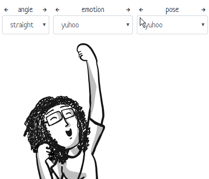


## Composition

To combine multiple characters in a panel, embed them in an `<svg>` element.

You can change the `x`, `y`, `width`, `height`, `mirror` and `scale` to position each character.

```html
<svg width="500" height="600">
  <g class="comicgen" name="dee" angle="straight" emotion="smilehappy" pose="pointingright" x="-120"></g>
  <g class="comicgen" name="dey" angle="straight" emotion="smile" pose="handsinpocket" x="150"></g>
</svg>
```

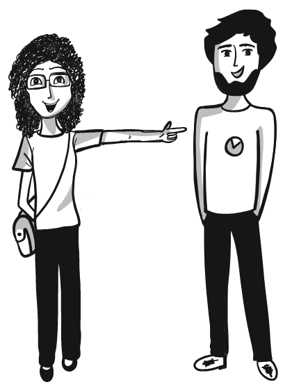

<a class="btn btn-primary" target="_blank" rel="noopener" href="https://codepen.io/sanand0/pen/eqYmer">Try it on Codepen</a>


You can resize the combined image by changing the `width` and `height` of the
SVG container.

```html
<svg width="300" height="200" viewBox="0 0 500 600">
  <g class="comicgen" name="dee" angle="straight" emotion="smilehappy" pose="pointingright" x="-120"></g>
  <g class="comicgen" name="dey" angle="straight" emotion="smile" pose="handsinpocket" x="150"></g>
</svg>
```

Set `viewBox` to the width and height of the comicgen elements. Then you can set
the outer `width` and `height` to anything.

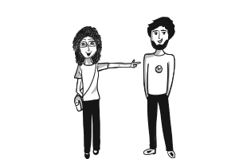

This normally scales the image to fit both the width and height. To fit only one
side, use [preserveAspectRatio](https://developer.mozilla.org/en-US/docs/Web/SVG/Attribute/preserveAspectRatio).
For example, `preserveAspectRatio="xMidYMin slice"` in this case fits to width
and slices the height, preserving the top (YMin) of the image.

```html
<svg width="300" height="200" viewBox="0 0 500 600" preserveAspectRatio="xMidYMin slice">
  <g class="comicgen" name="dee" angle="straight" emotion="smilehappy" pose="pointingright" x="-120"></g>
  <g class="comicgen" name="dey" angle="straight" emotion="smile" pose="handsinpocket" x="150"></g>
</svg>
```

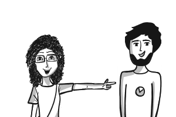

## Panels

[comicgen.css](https://unpkg.com/comicgen/dist/comicgen.min.css)
provides 2 classes for layout:

- `comic-panel`
- `comic-row`

Use `class="comic-panel"` to can embed characters in a thick grey border. For example

```html
<div class="comic-panel">
  <g class="comicgen" name="dee" angle="straight" emotion="smilehappy" pose="handsfolded"
    x="-320" y="-120" scale="2.2" width="200" height="200"></g>
</div>
```


Panels are typically placed inside a `class="comic-row"`:

Here's an example with 2 panels. The second panel has 2 characters.

```html
<div class="comic-row">
  <div class="comic-panel" style="margin-right: 10px">
    <g class="comicgen" name="dee" angle="straight" emotion="smilehappy" pose="handsfolded"
      x="-320" y="-120" scale="2.2" width="200" height="200"></g>
  </div>
  <div class="comic-panel">
    <svg width="200" height="200">
      <g class="comicgen" name="dey" angle="straight" emotion="smile" pose="handsinpocket"
        x="-200" y="-120" scale="2.2" width="200" height="200"></g>
      <g class="comicgen" name="dee" angle="straight" emotion="smilehappy" pose="handsfolded"
        x="-250" y="-120" scale="1.4" width="200" height="200"></g>
    </svg>
  </div>
</div>
```

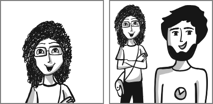

<a class="btn btn-primary" target="_blank" rel="noopener" href="https://codepen.io/sanand0/pen/ZgEYvx">Try it on Codepen</a>

You can override the panel's background, border width and color using CSS
variables in your stylesheet.

```css
:root {
  --comic-background: #eee;     /* Light grey background. Default: transparent */
  --comic-border-color: #ccc;   /* Light grey border. Default: grey */
  --comic-border-width: 1px;    /* Thin border. Default 2px */
}
```


## Captions

[comicgen.css](https://unpkg.com/comicgen/dist/comicgen.min.css)
provides `comic-caption-top` and `comic-caption-bottom` to add captions inside
a `.comic-panel`.

For example, this defines a caption on top:

```html
<div class="comic-panel">
  <div class="comic-caption-top">Hi! I'm Dee.</div>
  <g class="comicgen" name="dee" angle="straight" emotion="smilehappy" pose="handsfolded" x="-317" y="-119" scale="2.2" width="150" height="200"></g>
</div>
```

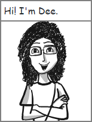

<a class="btn btn-primary" target="_blank" rel="noopener" href="https://codepen.io/sanand0/pen/XvWJEP">Try it on Codepen</a>

... or the bottom:

```html
<div class="comic-panel">
  <div class="comic-caption-bottom">Hi! I'm Dee.</div>
  <g class="comicgen" name="dee" angle="straight" emotion="smilehappy" pose="handsfolded" x="-317" y="-119" scale="2.2" width="150" height="200"></g>
</div>
```

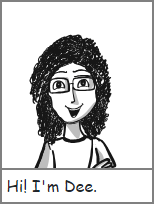

You can override the caption's background, font and padding using CSS variables
in your stylesheet.

```css
:root {
  --comic-caption-background: #eee;         /* Light grey background. Default: white */
  --comic-caption-font: Neucha, cursive;    /* Custom Google font. Default: cursive */
  --comic-caption-padding: 0.25rem 0.5rem;  /* Custom margin. Default: 0.25rem */
}
.comic-caption-top, .comic-caption-bottom { /* Apply any custom styles you want */
  text-transform: uppercase;
}
```

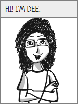

## Fonts

[Google fonts has handwriting fonts](https://fonts.google.com/?category=Handwriting)
that can be used for the caption lettering.

Some fonts we like are:

| Font                            | Example text                                                         |
|---------------------------------|----------------------------------------------------------------------|
| [Architects Daughter][font-ad]  | [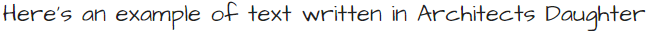][font-ad] |
| [News Cycle][font-nc]           | [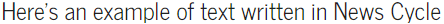][font-nc]                   |
| [Indie Flower][font-if]         | [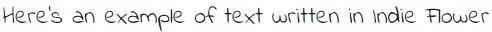][font-if]               |
| [Amatic SC][font-ac]            | [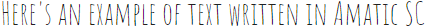][font-ac]                     |
| [Just Another Hand][font-jah]   | [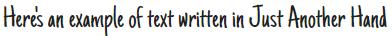][font-jah]    |
| [Patrick Hand][font-ph]         | [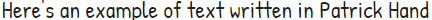][font-ph]               |
| [Neucha][font-n]                | [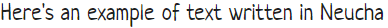][font-n]                            |
| [Handlee][font-h]               | [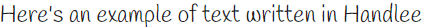][font-h]                          |

[font-ad]: https://fonts.google.com/specimen/Architects+Daughter
[font-nc]: https://fonts.google.com/specimen/News+Cycle
[font-if]: https://fonts.google.com/specimen/Indie+Flower
[font-ac]: https://fonts.google.com/specimen/Amatic+SC
[font-jah]: https://fonts.google.com/specimen/Just+Another+Hand
[font-ph]: https://fonts.google.com/specimen/Patrick+Hand
[font-n]: https://fonts.google.com/specimen/Neucha
[font-h]: https://fonts.google.com/specimen/Handlee

## Strips

You can combine [captions](#captions) with [panels](#panels) to create a strip
like this:

```html
<div class="comic-row">
  <div class="comic-panel">
    <div class="comic-caption-top">Hi! I'm Dee.</div>
    <g class="comicgen" name="dee" angle="straight" emotion="smilehappy" pose="handsfolded" x="-317" y="-119" scale="2.2" width="150" height="200"></g>
  </div>
  <div class="comic-panel">
    <div class="comic-caption-top">I'm in a comic strip called Dee & Dey.</div>
    <g class="comicgen" name="dee" angle="straight" emotion="smilehappy" pose="handsfolded" x="-150" y="10" scale="1.5" width="150" height="200" mirror="1"></g>
  </div>
  <div class="comic-panel">
    <div class="comic-caption-top">And this is Dey, my co-star on this strip.</div>
    <svg width="300" height="200">
      <g class="comicgen" name="dee" angle="straight" emotion="smilehappy" pose="pointingright" x="160" y="0" scale="0.88" width="300" height="200" mirror="1"></g>
      <g class="comicgen" name="dey" angle="straight" emotion="smile" pose="handsinpocket" x="-120" y="10" scale="0.88" width="300" height="200"></g>
    </svg>
  </div>
</div>
```

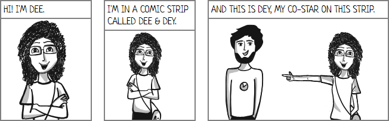

<a class="btn btn-primary" target="_blank" rel="noopener" href="https://codepen.io/sanand0/pen/dxyPex">Try it on Codepen</a>


## Add new characters

To add a new character, or add images for an existing character:

1. Add the SVG images under `svg/<character>/<attr>/.../<file>.svg`
2. File or folder names must use only lowercase letters
3. Compress the characters and create PNGs: `bash png.sh`. This requires [svgo](https://github.com/svg/svgo), [ImageMagick](https://imagemagick.org/script/convert.php) and [pngquant](https://pngquant.org/).
4. Update [src/comicgen.js](src/comicgen.js). Add new character specs under `comicgen.namemap` and `comicgen.formats` using the instructions there
5. Update [files.json](files.json) to add new files. This is organized as `{character: {attr: [file, file, ...]}}`
6. Update the [character credits](#character-credits)
7. Run `npm run build` to recompile files under `dist/`


## Release

New versions of comicgen are released on [Github](https://github.com/gramener/comicgen/)
and [npm](https://www.npmjs.com/package/comicgen). Here is the release process.

```bash
# Update package.json version and build
npm run build
bash png.sh

# Run tests on dev branch
npm run lint
npm test
npm run test-chrome
npm run test-edge
npm run test-firefox

# Ensure that there are no build errors on the server
git commit . -m"DOC: Release version x.x.x"
git push

# Merge into dev branch
git checkout master
git merge dev
git tag -a v0.x.x -m"Add a one-line summary"
git push --follow-tags
git checkout dev
```

Then release on [npm](https://www.npmjs.com/package/comicgen)

```bash
# Maintained by @sanand0
npm publish
```

The PNG conversion on [Gramener.com](https://gramener.com/comicgen/) with ImageMagick 6.8.9 is poor. It works well on Cygwin's ImageMagick 6.9.10. So upload the files locally using:

```bash
rsync -avzP png ubuntu@gramener.com:/mnt/gramener/apps/static/comicgen/
```

Deploy on <https://comicgen.surge.sh/> via:

```bash
# Log in as s.anand@gramener.com
surge . comicgen.surge.sh
```


## Help wanted (developers)

If you're a developer, we'd love your help in improving comicgen.

1. **Report bugs**. If something doesn't work the way you expect, please [add an issue](https://github.com/gramener/comicgen/issues)
2. **Ask for features**. Go through the [issues](https://github.com/gramener/comicgen/issues). Add a [Like reaction](https://help.github.com/en/articles/about-conversations-on-github#reacting-to-ideas-in-comments) to what you like. Or add an issue asking for what you want.
3. **Offer help**. Go through these issues. Pick something interesting. Add a comment saying "I'd like to help." We'll revert in 2-4 days with ideas.

There are 3 areas we're focusing on. Help in these areas would be ideal.

### 1. Integrate comicgen into platforms

People like to use their own platforms, not switch to a new one. So let's integrate comicgen into popular platforms like Excel, PowerPoint, Power BI, Tableau, R, etc as plugins.

[See **integration** issues related &raquo;](https://github.com/gramener/comicgen/labels/integrate)

### 2. Create a comic builder UI

People find it easier to create comics using a UI than programming. So let's create an [interface](https://gramener.com/comicgen/) that let people create an entire graphic novel!

[See **builder** issues &raquo;](https://github.com/gramener/comicgen/labels/builder)

### 3. Improving comicgen API

Developers access comicgen through a JS library. What can we do to make it easier, and feature rich?

[See **API** issues &raquo;](https://github.com/gramener/comicgen/labels/api)

<!-- end -->

<!-- var credits -->

## Credits

- Library developed by Kriti Rohilla <kriti.rohilla@gramenerit.com> and S Anand <s.anand@gramener.com>
- Conceived & designed by Ramya Mylavarapu <ramya.mylavarapu@gramener.com> & Richie Lionell <richie.lionell@gramener.com>

### Character credits

- Dee, Dey & Ringo: By Ramya Mylavarapu <ramya.mylavarapu@gramener.com>
  under [CC0 license](https://creativecommons.org/choose/zero/)
- [Humaaans](https://www.humaaans.com/): By [Pablo Stanley](https://twitter.com/pablostanley)
  under [CC-BY license](https://creativecommons.org/licenses/by/4.0/)
- Facesketch: By Devarani B <devarani.b@gramener.com>
  under [CC0 license](https://creativecommons.org/choose/zero/)
- Aryan, Zoe: By Swetha Mylavarapu
  under [CC0 license](https://creativecommons.org/choose/zero/)

<!-- end -->

<!-- var design -->
## Help wanted (designers)

Designers, we'd love your help in improving comicgen.

If you're a designer, you could help by:

1. **Designing new characters**. Comicgen characters are open for everyone to use. We [credit the authors](#credits). You can work [freelance](#freelancing) with us, and get paid per character. You can pick your own character, or choose from the [characters people are looking for](https://github.com/gramener/comicgen/labels/characters).
2. **Adding new layers**. Apart from characters, we need other "layers" -- things we can add to panel, like speech bubbles, background objects, etc. You can design new kinds of objects if you think people will use it. Here are some [layers people have asked for](https://github.com/gramener/comicgen/labels/layers).

Here's a guide to help understand how to design and submit new characters or layers.

### Add new characters

Characters are made of 1 or more SVG images.

The easiest way to create a character is to draw a dozen SVGs and save them as
individual files **of the same dimensions**. For example:

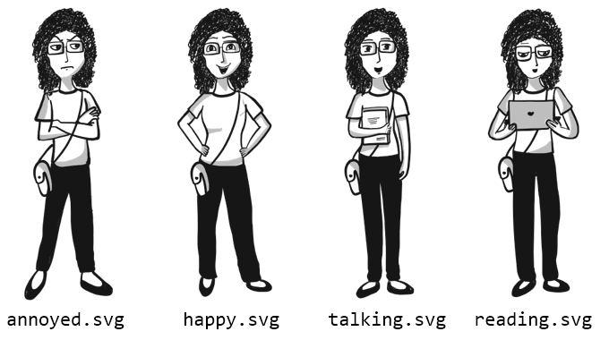

A better way would be to break up the character into different parts. For
example, you could draw faces with different emotions and save them under an
`faces/` folder:


Then you could draw the bodies under a `bodies/` folder:

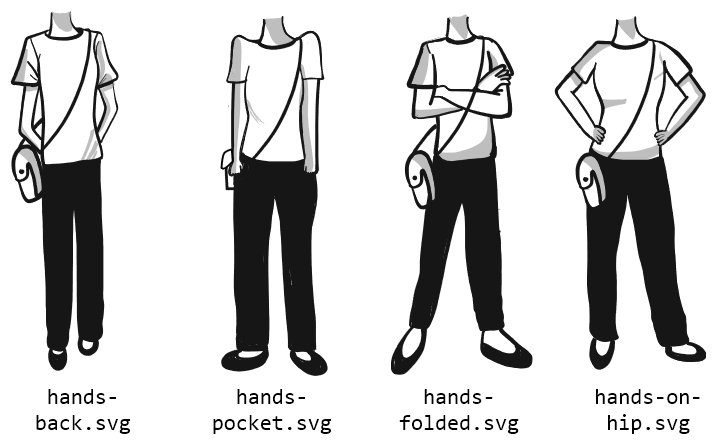

If you do this, you must make sure that:

- All faces have the **same dimensions**, and are at the **same position** within the SVG
- All bodies have the **same dimensions**, and are at the **same position** within the SVG
- When you super-impose any face on any body, the **images should align**.

You can choose to break up the images in any number of ways. For example:

- `faces/`, `bodies/`
- `face/`, `trunk/`, `leg/`, `shoes/`
- `hair/`, `face/`, `eyes/`, `mouth/`, `trunk/`, `legs/`

The more combinations you have, the more complex your image becomes. You could
start small and then add variety.

### Submit new characters

Give your character a name (e.g. "Ant Man"). Save the SVG files under a folder
with the character name (e.g. "ant-man" - lower-case, use hyphens as separator).
Add this folder under the
[svg/](https://github.com/gramener/comicgen/tree/master/svg/) folder.

Then [send a pull request](https://help.github.com/en/articles/creating-a-pull-request)
or email S Anand <s.anand@gramener.com>.

When doing this, please mention one of the following:

- "I release these images under the [CC0](https://creativecommons.org/choose/zero/) license", OR
- "I release these images under the [CC-BY](https://creativecommons.org/licenses/by/4.0/) license"


### Freelancing

Comicgen is free, but their designers' time is not. We pay the designers in our team, and freelancers, for the characters they design.

Please e-mail Anand <s.anand@gramener.com> and Richie <richie.lionell@gramener.com> if you can design characters as a freelancer. We'd love your help.

<!-- end -->

<!-- var social -->
<!-- This won't appear on Github. This is just for index.html -->
<div class="d-flex justify-content-between">
  <div class="align-items-center">
    <a href="https://twitter.com/search?f=tweets&vertical=default&q=comicgen&src=typd" class="btn btn-primary btn-sm d-flex" target="_blank" rel="noopener" title="Discuss on Twitter">
      <i class="fab fa-twitter-square fa-2x mr-2"></i>
      <span class="align-items-center d-none d-md-flex mr-2">Discuss on Twitter:</span>
      <span class="align-items-center d-flex">#comicgen</span>
    </a>
  </div>
  <div class="d-flex align-items-center">
    <a href="https://twitter.com/intent/tweet?text=Make%20your%20own%20comics%20with%20the%20%23comicgen%20JS%20API%20by%20%40Gramener%20https%3A%2F%2Fgramener.com%2Fcomicgen%2F" class="btn btn-link py-0 pl-0 pr-1" target="_blank" rel="noopener" title="Share on Twitter">
      <i class="fab fa-twitter-square fa-2x"></i>
    </a>
    <a href="https://www.facebook.com/dialog/share?app_id=163328100435225&display=page&href=https%3A%2F%2Fgramener.com%2Fcomicgen%2F&redirect_uri=https%3A%2F%2Fgramener.com%2Fcomicgen%2F&quote=Make%20your%20own%20comics%20with%20the%20%23comicgen%20JS%20API%20by%20%40Gramener%20https%3A%2F%2Fgramener.com%2Fcomicgen%2F" class="btn btn-link py-0 pl-0 pr-1" target="_blank" rel="noopener" title="Share on Facebook">
      <i class="fab fa-facebook-square fa-2x"></i>
    </a>
    <a href="https://www.linkedin.com/sharing/share-offsite/?url=https://gramener.com/comicgen/" class="btn btn-link py-0 pl-0 pr-1" target="_blank" rel="noopener" title="Share on LinkedIn">
      <i class="fab fa-linkedin fa-2x"></i>
    </a>
    <a href="https://news.ycombinator.com/item?id=20049116" class="btn btn-link py-0 pl-0 pr-1" target="_blank" rel="noopener" title="Discuss on Hacker News">
      <i class="fab fa-hacker-news fa-2x"></i>
    </a>
    <a href="https://github.com/gramener/comicgen" class="btn btn-link py-0 pl-0 pr-1" target="blank" rel="noopener" title="Fork on Github">
      <i class="fab fa-github fa-2x"></i>
    </a>
  </div>
</div>
<!-- end -->

<!-- var social_markdown -->
<!-- Github README won't display the above share icons. So create links. Don't display this on index.html -->
## Share

- [Discuss on Twitter. Hashtag #comicgen](https://twitter.com/search?f=tweets&vertical=default&q=comicgen&src=typd)
- [Share on Twitter](https://twitter.com/intent/tweet?text=Make%20your%20own%20comics%20with%20the%20%23comicgen%20JS%20API%20by%20%40Gramener%20https%3A%2F%2Fgramener.com%2Fcomicgen%2F)
- [Share on Facebook](https://www.facebook.com/dialog/share?app_id=163328100435225&display=page&href=https%3A%2F%2Fgramener.com%2Fcomicgen%2F&redirect_uri=https%3A%2F%2Fgramener.com%2Fcomicgen%2F&quote=Make%20your%20own%20comics%20with%20the%20%23comicgen%20JS%20API%20by%20%40Gramener%20https%3A%2F%2Fgramener.com%2Fcomicgen%2F)
- [Share on LinkedIn](https://www.linkedin.com/sharing/share-offsite/?url=https://gramener.com/comicgen/)
- [Discuss on Hacker News](https://news.ycombinator.com/item?id=20049116)
- [Fork on Github](https://github.com/gramener/comicgen)
<!-- end -->
