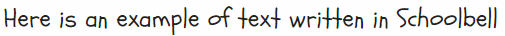

# Comicgen

<!-- var introduction -->
We love comics. We badly wanted to create comic strips. But there was one
problem. Some of us can't draw a straight line for nuts.

But why should that stop us from creating comics? So here's a gift to ourselves
and the world &mdash; a **Comic Creator**.

We created Comicgen to help people write better stories using comic.


----

Interested in data storytelling? Come **join the [#ComicgenFriday](https://gramener.com/comicgenfriday/) community**.

<!-- end -->

<!-- var usage -->
## Usage

A simple way to use Comicgen is from [gramener.com/comicgen/](https://gramener.com/comicserver/).

- Choose your character
- Save the image as SVG
- Insert it into your favorite editor - Illustrator, PowerPoint, Photoshop, etc.

Here's a 3-minute video explaining how to create your own comic strip.

<iframe width="560" height="315" src="https://www.youtube.com/embed/E_2hdZuugI8" frameborder="0" allow="accelerometer; autoplay; encrypted-media; gyroscope; picture-in-picture" allowfullscreen></iframe>

## Fonts

For lettering, you can use comic fonts from
[Google fonts](https://fonts.google.com/?category=Handwriting) or
[Fonts.com](https://www.fonts.com/search/all-fonts?Classification=Comic).

Some fonts we like are:

| Font                              | Example text                                                                             |
|-----------------------------------|------------------------------------------------------------------------------------------|
| [Architects Daughter][font-ad]    | [][font-ad]  |
| [Cavolini][font-ca] (Windows)     | [][font-ca]             |
| [Segoe Script][font-ss] (Windows) | [][font-ss]         |
| [Segoe Print][font-sp] (Windows)  | [][font-sp]          |
| [News Cycle][font-nc]             | [][font-nc]           |
| [Indie Flower][font-if]           | [][font-if]         |
| [Amatic SC][font-ac]              | [][font-ac]            |
| [Schoolbell][font-sb]             | [][font-sb]           |
| [Just Another Hand][font-jah]     | [][font-jah]   |
| [Patrick Hand][font-ph]           | [][font-ph]         |
| [Neucha][font-n]                  | [][font-n]                |
| [Handlee][font-h]                 | [][font-h]               |

[font-ca]: https://www.fonts.com/font/monotype/cavolini
[font-ad]: https://fonts.google.com/specimen/Architects+Daughter
[font-ss]: https://www.fonts.com/font/microsoft-corporation/segoe-script
[font-sp]: https://www.fonts.com/font/microsoft-corporation/segoe-print
[font-nc]: https://fonts.google.com/specimen/News+Cycle
[font-if]: https://fonts.google.com/specimen/Indie+Flower
[font-ac]: https://fonts.google.com/specimen/Amatic+SC
[font-sb]: https://fonts.google.com/specimen/Schoolbell
[font-jah]: https://fonts.google.com/specimen/Just+Another+Hand
[font-ph]: https://fonts.google.com/specimen/Patrick+Hand
[font-n]: https://fonts.google.com/specimen/Neucha
[font-h]: https://fonts.google.com/specimen/Handlee

## Plugins

You can also use Comicgen using the [plugins](#plugins) below.
(We're planning [more plugins](https://github.com/gramener/comicgen/labels/integrate). Your help is welcome!)

### Power BI plugin

The [Comicgen Power BI](https://github.com/gramener/comicgen-powerbi) plugin
lets you control the characters, emotions, poses, etc from data. Happy people
can accompany good news on charts.


<!-- end -->

<!-- var api -->

## REST API

Comics are rendered via the endpoint `https://gramener.com/comicgen/v1/comic`. We'll refer to
this as `/comic` from now on.

Options for each character can be specified as URL query parameters. For example, to render Ethan's angling sideways, winking, we need:

- `name`: `ethan`
- `angle`: `side`
- `emotion`: `wink`
- `pose`: `normal`

This is exposed at `/comic?name=ethan&angle=side&emotion=wink&pose=normal`:


The full list of options is at [dist/characterlist.json](dist/characterlist.json).

You can create comics by directly linking to these files.
You can embed these files directly in your plugin.

<!-- end -->

<!-- var vision -->

## Our audience are storytellers

Storytellers want to share a message and change their audience. But they worry that their content is not engaging or "catchy" enough to drive the change.

- **Comics are "catchy"**. That makes them a powerful way of engaging the audience.
- **Comics are simple**. Comics are a signal that the content is simple, interesting and often funny. Authors also make comic content simpler, interesting, and funny -- making this a virtuous cycle.
- **Comics drive emotion**. The pictures convey emotions better than just the words alone. They're funny. That helps learning, and makes the stories more memorable.

Anyone who writes an email, a presentation, or a document, is a storyteller.

Within organizations, we see this in:

- **Presenting insights**
  - **Executives' analysis**. An analyst created a poster explaining their work using comic characters. It was simple and engaging -- the entire organization understood this deep learning technique.
  - **Managers' reports**. An admin manager sent his status report as a pair of comic characters conversing. Their CEO read this report fully for the first time.
  - **Consultants' workshops**. A consultant runs a culture workshop using [comics in the presentation](https://www.businessillustrator.com/culture-change-with-comics-workshop/) because "... it's a lot less threatening than an official PowerPoint presentation."
- **Marketing stories**. This could be:
  - **Product teams launching features**. Google Chrome was launched using a [comic book](http://scottmccloud.com/googlechrome/).
  - **Marketer emails**
  - **Event manager invites**

## Comicgen makes storytelling easy

Our vision is to make storytelling with comics easy for everyone. (This includes non-designers, non-programmers, and non-storytellers.)

We do this by:

- [Adding characters](https://github.com/gramener/comicgen/labels/characters).
  Characters can be split into layers (like face & body). By combining these cleverly, we can create more characters with fewer drawings.
  If you have a character idea, please [add a comment](https://github.com/gramener/comicgen/issues/27).
- [Adding layers](https://github.com/gramener/comicgen/labels/layers). We need objects like speech bubbles, panels, headings, objects, scenery, backgrounds etc.
- [Integrate into your workflow](https://github.com/gramener/comicgen/labels/integrate). Comicgen should be easy to use in people's current workflow, with their existing tools.
    - Designers use Illustrator / Sketch
    - Developers use HTML / JS
    - Analysts use Tableau /  Power BI
    - Managers use e-mail / MS Office
    - We want to make storytelling easy for everyone
- [API for developers](https://github.com/gramener/comicgen/labels/api). Comicgen automates away the drudgery in creating comics. Developers should be able to create any comic without designing, purely using an API
- [UI for non-developers](https://github.com/gramener/comicgen/labels/builder). We want users to be able to do this without any programming. This means exposing every feature of the API should be exposed on the UI
- [Teaching](https://github.com/gramener/comicgen/labels/teach). The ultimate aim is for people to build better stories. Let's teach them

## We measure success by adoption

We succeed when more people create more and better stories with Comicgen. We measure this by

- How many people have used comicgen
- How many stories have been created using comicgen
- How many characters are present in comicgen. (Variety drives adoption)
- TODO: We need more intermediate success metrics -- things that will drive adoption

<!-- end -->

<!-- var development -->

## Add new characters

To add a new character, or add images for an existing character:

1. Add the SVG images under `svg/<character>/<attr>/.../<file>.svg`
2. File or folder names must use only lowercase letters. Avoid numbers or special characters
3. Add an `svg/<character>/index.json` and `svg/<character>/index.svg`. See `svg/dee/` for reference
4. Update the [character credits](#character-credits)
5. Run `npm run build` to recompile files under `dist/`
6. Run src/ on the comicgen folder and test the character

## Release

New versions of comicgen are released on [Github](https://github.com/gramener/comicgen/)
and [npm](https://www.npmjs.com/package/comicgen). Here is the release process:

```bash
# Commit all changes into the v1 branch.
# Update package.json version.
# Then:
npm upgrade
npm run build
npm run lint

# Ensure that there are no build errors on the server
git commit . -m"DOC: Release version x.x.x"
git push

# Merge into release branch
git checkout release
git merge v1
git tag -a v1.x.x -m"Add a one-line summary"
git push --follow-tags
git checkout v1
```

Then release on [npm](https://www.npmjs.com/package/comicgen)

```bash
# Maintained by @sanand0
npm publish
```

## Help wanted (developers)

If you're a developer, we'd love your help in improving comicgen.

1. **Report bugs**. If something doesn't work the way you expect, please [add an issue](https://github.com/gramener/comicgen/issues)
2. **Ask for features**. Go through the [issues](https://github.com/gramener/comicgen/issues). Add a [Like reaction](https://help.github.com/en/articles/about-conversations-on-github#reacting-to-ideas-in-comments) to what you like. Or add an issue asking for what you want.
3. **Offer help**. Go through these issues. Pick something interesting. Add a comment saying "I'd like to help." We'll revert in 2-4 days with ideas.

There are 3 areas we're focusing on. Help in these areas would be ideal.

### 1. Integrate comicgen into platforms

People like to use their own platforms, not switch to a new one. So let's integrate comicgen into popular platforms like Excel, PowerPoint, Power BI, Tableau, R, etc as plugins.

[See **integration** issues related &raquo;](https://github.com/gramener/comicgen/labels/integrate)

### 2. Create a comic builder UI

People find it easier to create comics using a UI than programming. So let's create an [interface](https://gramener.com/comicserver/) that let people create an entire graphic novel!

[See **builder** issues &raquo;](https://github.com/gramener/comicgen/labels/builder)

### 3. Improving comicgen API

Developers access comicgen through a JS library. What can we do to make it easier, and feature rich?

[See **API** issues &raquo;](https://github.com/gramener/comicgen/labels/api)

<!-- end -->

<!-- var credits -->

## Credits

- Library developed by
  - Kriti Rohilla <kriti.rohilla@gramenerit.com>
  - S Anand <s.anand@gramener.com>
  - Shamili Robbi <shamili.robbi@gramener.com>
  - Tejesh <tejesh.p@gramener.com>
- Conceived & designed by
  - Ramya Mylavarapu <ramya.mylavarapu@gramener.com>
  - Richie Lionell <richie.lionell@gramener.com>

### Character credits

- Ava, Bean, Biden, Dee, Dey, Evan, Holmes, Jaya, Priya, Ringo, Speechbubbles, Trump & Watson: By Ramya Mylavarapu <ramya.mylavarapu@gramener.com>
  under [CC0 license](https://creativecommons.org/choose/zero/)
- Bill: Renel McCullum
  under [CC0 license](https://creativecommons.org/choose/zero/)
- [Humaaans](https://www.humaaans.com/): By [Pablo Stanley](https://twitter.com/pablostanley)
  under [CC-BY license](https://creativecommons.org/licenses/by/4.0/)
- Facesketch & Ethan: By Devarani B <devarani.b@gramener.com>
  under [CC0 license](https://creativecommons.org/choose/zero/)
- Aryan, Zoe: By Swetha Mylavarapu
  under [CC0 license](https://creativecommons.org/choose/zero/)
- Ricky: By Suchismita Naik
  under [CC0 license](https://creativecommons.org/choose/zero/)

<!-- end -->

<!-- var design -->
## Help wanted (designers)

Designers, we'd love your help in improving comicgen.

If you're a designer, you could help by:

1. **Designing new characters**. Comicgen characters are open for everyone to use. We [credit the authors](#credits). You can work [freelance](#freelancing) with us, and get paid per character. You can pick your own character, or choose from the [characters people are looking for](https://github.com/gramener/comicgen/labels/characters).
2. **Adding new layers**. Apart from characters, we need other "layers" -- things we can add to panel, like speech bubbles, background objects, etc. You can design new kinds of objects if you think people will use it. Here are some [layers people have asked for](https://github.com/gramener/comicgen/labels/layers).

Here's a guide to help understand how to design and submit new characters or layers.

### Add new characters

Characters are made of 1 or more SVG images.

The easiest way to create a character is to draw a dozen SVGs and save them as
individual files **of the same dimensions**. For example:


A better way would be to break up the character into different parts. For
example, you could draw faces with different emotions and save them under an
`faces/` folder:


Then you could draw the bodies under a `bodies/` folder:


If you do this, you must make sure that:

- All faces have the **same dimensions**, and are at the **same position** within the SVG
- All bodies have the **same dimensions**, and are at the **same position** within the SVG
- When you super-impose any face on any body, the **images should align**.

You can choose to break up the images in any number of ways. For example:

- `faces/`, `bodies/`
- `face/`, `trunk/`, `leg/`, `shoes/`
- `hair/`, `face/`, `eyes/`, `mouth/`, `trunk/`, `legs/`

The more combinations you have, the more complex your image becomes. You could
start small and then add variety.

### Submit new characters

Give your character a name (e.g. "Ant Man"). Save the SVG files under a folder
with the character name (e.g. "ant-man" - lower-case, use hyphens as separator).
Add this folder under the
[svg/](https://github.com/gramener/comicgen/tree/master/svg/) folder.

Then [send a pull request](https://help.github.com/en/articles/creating-a-pull-request)
or email S Anand <s.anand@gramener.com>.

When doing this, please mention one of the following:

- "I release these images under the [CC0](https://creativecommons.org/choose/zero/) license", OR
- "I release these images under the [CC-BY](https://creativecommons.org/licenses/by/4.0/) license"


### Freelancing

Comicgen is free, but their designers' time is not. We pay the designers in our team, and freelancers, for the characters they design.

Please e-mail Anand <s.anand@gramener.com> and Richie <richie.lionell@gramener.com> if you can design characters as a freelancer. We'd love your help.

<!-- end -->

<!-- var social -->
<div class="d-flex justify-content-between">
  <div class="align-items-center d-none d-sm-block">
    <a href="https://twitter.com/search?f=tweets&vertical=default&q=comicgen&src=typd" class="btn btn-primary btn-sm d-flex" target="_blank" rel="noopener" title="Discuss on Twitter">
      <i class="fab fa-twitter-square fa-2x me-2"></i>
      <span class="align-items-center d-none d-md-flex me-2">Discuss on Twitter:</span>
      <span class="align-items-center d-flex">#comicgen</span>
    </a>
  </div>
  <div class="align-items-center d-none d-sm-block">
    <!-- Responses at https://docs.google.com/spreadsheets/d/1BGBydJvKFDy9WsSVenkxw6Z4PK5H52ucQHJpb4IxAjA/edit#gid=378739795 managed by comicgen@gramener.com -->
    <a href="https://forms.gle/po34LPvj3qaqy1Md7" class="btn btn-primary btn-sm d-flex" target="_blank" rel="noopener" title="Share your feedback">
      <i class="fas fa-comments fa-2x me-2"></i>
      <span class="align-items-center d-none d-md-flex me-2">Suggest improvements</span>
    </a>
  </div>
  <!-- These icons won't appear on Github. This is just for index.html -->
  <div class="d-flex align-items-center">
    <a href="https://twitter.com/intent/tweet?text=Make%20your%20own%20comics%20with%20the%20%23comicgen%20JS%20API%20by%20%40Gramener%20https%3A%2F%2Fgramener.com%2Fcomicgen%2F" class="btn btn-link py-0 ps-0 pe-1" target="_blank" rel="noopener" title="Share on Twitter">
      <i class="fab fa-twitter-square fa-2x"></i>
    </a>
    <a href="https://www.facebook.com/dialog/share?app_id=163328100435225&display=page&href=https%3A%2F%2Fgramener.com%2Fcomicgen%2F&redirect_uri=https%3A%2F%2Fgramener.com%2Fcomicgen%2F&quote=Make%20your%20own%20comics%20with%20the%20%23comicgen%20JS%20API%20by%20%40Gramener%20https%3A%2F%2Fgramener.com%2Fcomicgen%2F" class="btn btn-link py-0 ps-0 pe-1" target="_blank" rel="noopener" title="Share on Facebook">
      <i class="fab fa-facebook-square fa-2x"></i>
    </a>
    <a href="https://www.linkedin.com/sharing/share-offsite/?url=https://gramener.com/comicserver/" class="btn btn-link py-0 ps-0 pe-1" target="_blank" rel="noopener" title="Share on LinkedIn">
      <i class="fab fa-linkedin fa-2x"></i>
    </a>
    <a href="https://news.ycombinator.com/item?id=20049116" class="btn btn-link py-0 ps-0 pe-1" target="_blank" rel="noopener" title="Discuss on Hacker News">
      <i class="fab fa-hacker-news fa-2x"></i>
    </a>
    <a href="https://github.com/gramener/comicgen" class="btn btn-link py-0 ps-0 pe-1" target="blank" rel="noopener" title="Fork on Github">
      <i class="fab fa-github fa-2x"></i>
    </a>
  </div>
</div>
<!-- end -->

<!-- var privacypolicy -->

### Privacy Policy

Gramener visuals do not externally collect any information, personal or otherwise.
If you have any questions, please contact us at [comicgen.powerbi@gramener.com](mailto:comicgen.powerbi@gramener.com)

<!-- end -->


<!-- var social_markdown -->
<!-- Github README won't display the above share icons. So create links. Don't display this on index.html -->
## Share

- [Discuss on Twitter. Hashtag #comicgen](https://twitter.com/search?f=tweets&vertical=default&q=comicgen&src=typd)
- [Share on Twitter](https://twitter.com/intent/tweet?text=Make%20your%20own%20comics%20with%20the%20%23comicgen%20JS%20API%20by%20%40Gramener%20https%3A%2F%2Fgramener.com%2Fcomicgen%2F)
- [Share on Facebook](https://www.facebook.com/dialog/share?app_id=163328100435225&display=page&href=https%3A%2F%2Fgramener.com%2Fcomicgen%2F&redirect_uri=https%3A%2F%2Fgramener.com%2Fcomicgen%2F&quote=Make%20your%20own%20comics%20with%20the%20%23comicgen%20JS%20API%20by%20%40Gramener%20https%3A%2F%2Fgramener.com%2Fcomicgen%2F)
- [Share on LinkedIn](https://www.linkedin.com/sharing/share-offsite/?url=https://gramener.com/comicserver/)
- [Discuss on Hacker News](https://news.ycombinator.com/item?id=20049116)
- [Fork on Github](https://github.com/gramener/comicgen)
<!-- end -->
